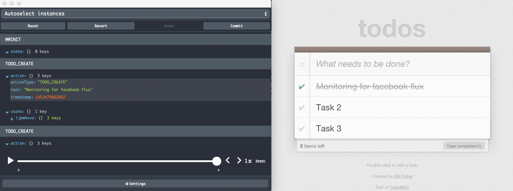

RemoteDev
=========

Monitoring flux app's actions along with states to a remote monitor. Meant to be used even in production with any flux architecture for web, universal, React Native, hybrid, desktop and server side apps.



### Installation

##### NPM
```
npm install --save-dev remotedev
```

##### CDN
```
<script src="https://unpkg.com/remotedev/dist/remotedev.min.js"></script>
```

### Usage

```js
import { connectViaExtension, extractState } from 'remotedev';
// It will try to use Redux DevTools extension first if installed
// In case you want only remote monitoring use `connect`:
// import { connect, extractState } from 'remotedev';

// Connect to the monitor
remotedev = connectViaExtension();

// Subscribe to change state (if need more than just logging)
remotedev.subscribe(message => {
  // Helper when only time travelling needed
  extractState(message, state => {
    this.setState(state);
  });
});

// Send changes to the remote monitor
remotedev.send(action, state);
```

See [the examples for different flux architectures](https://github.com/zalmoxisus/remotedev/tree/master/examples).

### Monitoring

Use one of our monitor apps to inspect and dispatch actions:
* [web](http://remotedev.io/local)
* [redux-devtools-extension](https://github.com/zalmoxisus/redux-devtools-extension) - Click "Remote" button (or press [`Cmd+Ctrl+Arrow up`](https://github.com/zalmoxisus/redux-devtools-extension#keyboard-shortcuts)) to open remote monitoring.
* [react-native-debugger](https://github.com/jhen0409/react-native-debugger) - Electron app, which already includes `remotedev-server`, `remotedev-app` and even React DevTools.
* [chrome app](https://chrome.google.com/webstore/detail/remotedev/faicmgpfiaijcedapokpbdejaodbelph).
* [remote-redux-devtools-on-debugger](https://github.com/jhen0409/remote-redux-devtools-on-debugger) - Used in React Native debugger as a dock monitor.
* [atom-redux-devtools](https://github.com/zalmoxisus/atom-redux-devtools) - Used in Atom editor.
* [redux-dispatch-cli](https://github.com/jhen0409/redux-dispatch-cli) - A CLI tool for Redux remote dispatch.

Use [remotedev-app](https://github.com/zalmoxisus/remotedev-app) to create your own monitor app.

### Communicate via local server

In order to make it simple to use, by default, the module and the monitor app communicate via [remotedev.io](http://remotedev.io) server. Use [remotedev-server](https://github.com/zalmoxisus/remotedev-server) cli to run it locally in order to make the connection faster and not to require an internet connection.
You can import it in your `server.js` script and start remotedev server together with your development server:
```js
var remotedev = require('remotedev-server');
remotedev({ hostname: 'localhost', port: 8000 });
```
See [remotedev-server](https://github.com/zalmoxisus/remotedev-server) repository for more details.
For React Native you can use [react-native-debugger](https://github.com/jhen0409/react-native-debugger) or [remote-redux-devtools-on-debugger](https://github.com/jhen0409/remote-redux-devtools-on-debugger), which already include `remotedev-server`.

### License

MIT
